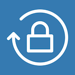

# PassGen #

    
    <h6>Minimalist password generator for iOS.</h6>

⚠️ This project is for internal use only. Do not distribute on App Store.

## Requirements

    
⚒ SwiftLint — A tool to enforce Swift style and conventions.

    [SwiftLint Installation](https://github.com/realm/SwiftLint/blob/master/README.md#installation)

    
📦 CocoaPods — CocoaPods is a library dependencies for Xcode projects.

    [CocoaPods Installation](https://guides.cocoapods.org/using/getting-started.html#getting-started)

    
💉 SwiftGen — A tool to auto-generate Swift code for resources of your projects.

    [SwiftGen Installation](https://github.com/SwiftGen/SwiftGen/blob/master/README.md#installation)

## License
This code is distributed under the GNU GLPv3 license. See the [LICENSE](https://www.gnu.org/licenses/gpl-3.0.txt) file for more info.
